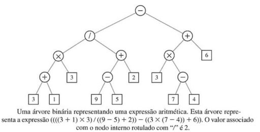
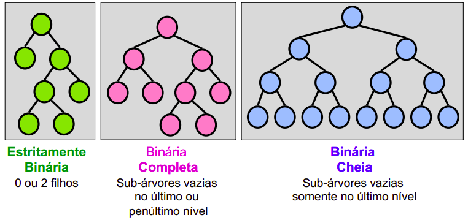
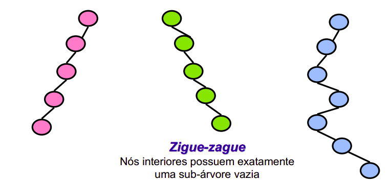
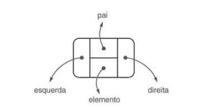
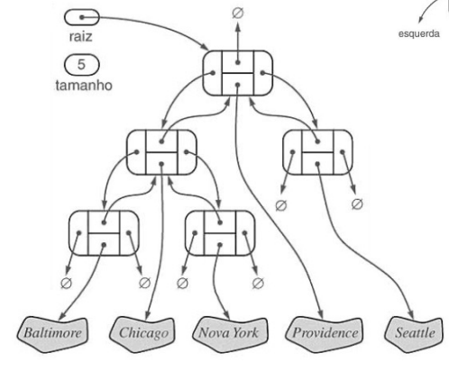
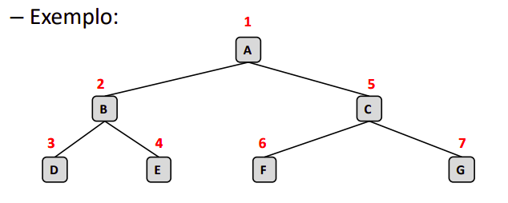
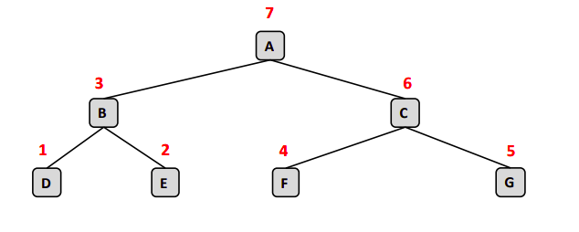
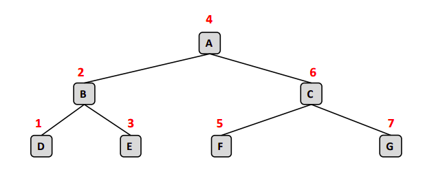

# Arvores de Pesquisa Binária

## O que é?

É uma estrutura BALANCEADA
## Como é uma Arvore Binaria?
"Foto da arvore binaria"
Todos os elementos da direita são maiores que o nodo raiz? Sim !
Todos os elementos da esquerda são menores que o nodo raiz? Sim !
Então é uma arvore binária pois é balanceada!!

## Para que é usada?
As estruturas de árvores binárias são muito utilizadas
na computação
• Exemplos:
– Árvore para uma expressão aritmética
– Nodos externos são associados com variáveis e constantes
– Nodos internos são associados com um operador

### Tipos de Árvores Binárias:

## Como percorrer uma árvore binária:
 Forma mais usual de implementação
– Estruturas encadeadas (alocação dinâmica)
– Cada nodo conterá
• A informação
• Uma referência para o nodo pai
• Uma referências para a subárvore da esquerda
• Uma referências para a subárvore da direita

### Caminhamento
#### Pré - ordem
– Do inglês preorder traversal
– Nodo é visitado antes de seus descendentes
– Segue a ordem:
• Visite o nodo;
• Percorre subárvore da esquerda
• Percorre subárvore da direita 

#### Pós - ordem
– Do inglês postorder traversal
– Nodo é visitado depois de seus descentes
– Segue a ordem:
• Percorre subárvore da esquerda
• Percorre subárvore da direita
• Visita raiz

#### Largura(foto do quadro)
– Visita os nodos na ordem dos níveis da árvore, da
esquerda para a direita
• Visite os nodos de nível 0;
• Visite os nodos de nível 1;
• ...
#### Caminhamento Central
– Segue a ordem:
• Percorre subárvore da esquerda
• Visita raiz
• Percorre subárvore da direita

# Exercicio:

Pré ordem:

Jul - Abr - Marc - Jan - Fev - Jun - Maio - Dez - Nov - Ago - Out - Set

Pós ordem: foto
Fev - jan -  Marc - Mai - Jun  - Abr - Set - Out - Ago - Nov - Dez - Jul

Largura: foto
Fev - jan -  Marc - Abr - Mai - Jun - Set - Out - Ago - Nov - Dez - Jul

Caminhamento central: foto
Esquerda central direita

