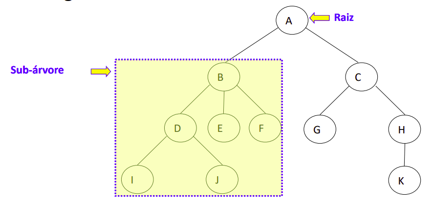

# Árvores Genéricas

## Descrição:
• São estruturas de dados não lineares que armazena dados de maneira não linear(Em cascata).

• Permitem a implementação de vários algoritmos mais rápidos do que no uso de estruturas de dados lineares como as listas

• Fornecem uma forma natural de organizar os dados
- Sistemas de arquivos
- Bancos de dados
- Sites da Web

• As arvores são conjuntos de nodos onde cada nodo da arvore é a raiz de uma sub árvore
API pontos de coleta(nodos)

## Conceitos:
• Outra propriedade de uma árvore T:
- Cada nodo v de T diferente da raiz tem um único nodo pai, w
- Todo nodo com pai w é filho de w

• Pela definição
- Uma árvore pode ser vazia, isto é, não possui nodos
- Esta convenção permite que se defina uma árvorerecursivamente

• Uma árvore T ou está vazia, ou consiste de um nodo r, chamado de
raiz de T, e um conjunto de árvores cujas raízes são filhas de r

## Operações:
inserção
obter valor da raiz
esvaziar uma arvore
obter uma subávore
anexar uma subárvore

## Complexidade:
## Aplicação
• Criar a classe abstrata nodos para que possamos criar os objetos

## Referencias:
•Livro do Goodrich e Tamassia
Estruturas de Dados & Algoritmos
5ª edição
(acesso online pela biblioteca da PUCRS)
–Seções relacionadas: 7.1
