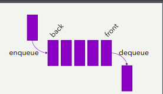

# Métodos da fila

## +enqueue(e): insere o elemento e no final da fila
## +dequeue(): remove e retorna o elemento e do início da fila, e dá erro se a fila estiver vazia
## +head(): retorna, mas não remove, o primeiro elemento da fila, e dá erro se a fila estiver vazia
## +size(): retorna o número de elementos da fila
## +isEmpty(): retorna true se a fila estiver vazia, e false caso contrário
## +clear(): esvazia a fila
