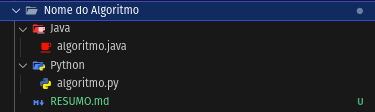
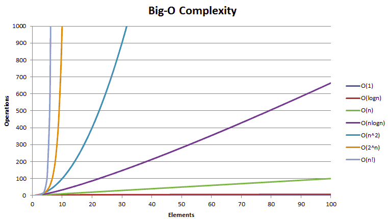

# Algoritmos e estrutura de dados

## Organização do diretório:
• Esse diretório é estruturado a partir pastas com os nomes do algoritmo implementado, arquivos dentro de subpastas com o nome da linguagem e um arquivo RESUMO.md que demonstra a parte teórica necessária para que implementação da parte prática da implementação do algoritmo. 

## Introdução:

## Maneiras de Resolver o mesmo problema
* Estrutura de Dados
* Complexidade do problema
## Como medir a Complexidade?

1. Hardware
2. Software
3. Implementação

Existem diversos Hardware, Softwares, Linguagens e formas de implementar  um algoritmo, sendo assim para analisarmos a complexidade de um algoritmo precisamos trata-lo da forma mais **genérica e independente** desses fatores o possível. Sendo assim medir apenas tempo de um algoritmo é uma resposta enviesada sobre seu custo operacional.

### Metodologia de medição de complexidade

#### 1. Contagem de operações:

* Taxa de crescimento a partir da notação Big O
![[Pasted image 20240521204252.png]]
##### Linear:
 * **O(1) tem a menor complexidade**
 * **_"tempo constante"_**
 Exemplo:
 * $O(n)=5n+3$
 * $O(1) = 5$
##### Logaritmo:
 * **O(log(n)) é mais complexo do que O(1), mas menos complexo do que polinômios**
 * **O(n log(n)) é menos complexo do que os polinômios **
 * **menos complexo que O(√n), pois a função da raiz quadrada pode ser considerada um polinômio**
  Exemplo:
 * $O(log(n)) = log(n) *2$

##### Polinomial:
* **A complexidade dos polinômios aumenta de acordo com o aumento do expoente**
 * **O(n⁵) é mais complexo que O(n⁴)**
 Exemplo:
* $O(n^2) = 9n+2n^2×2$
* $O(n^3) = 10n3−8n^2+24n​$
   
##### Exponencial:
 *  **Exponenciais têm maior complexidade do que polinômios, contanto que os coeficientes sejam múltiplos positivos de n**
 * **O(2ⁿ) é mais complexo que O(n⁹⁹), mas O(2ⁿ) é, de fato, menos complexo que O(1)**
  Exemplo:
 * $O(g^n) = O(g^{n-1})$

##### Fatorial:
*  **Fatoriais têm complexidade maior do que exponenciais*
*  **fatoriais e exponenciais têm o mesmo número de multiplicações, mas os números que são multiplicados crescem para os fatoriais, mas permanecem constantes para as exponenciais**
*  Exemplo:
* $O(n!) = n \times (n-1) \times (n-2) \times \ldots \times 2 \times 1$

###### Termos multiplicadores: 
complexidade será maior que a original, mas não mais que a equivalência de multiplicar algo que é mais complexo

###### Exemplos de nomenclatura Big O de algoritmos
![[Pasted image 20240521213916.png]]
#### 2. Alocação de memória

##### Contígua
* Array
##### Dinâmica
1. Encadeada
2. Duplamente encadeada
###### Estruturas de Dados Dinâmicos
###### Pilha(Last In First Out)
* Simplesmente encadeada
* Insere
* Remove
* Top

###### Fila(First In First Out)
* Simplesmente encadeada
* Duplamente encadeada
* Insere inicio
* Remove Final

